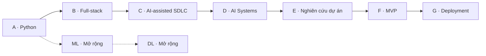

# Roadmap theo giai đoạn A–G

**Mục tiêu:** tự xây, giải thích, kiểm thử và vận hành một ứng dụng AI có phạm vi rõ. Cấu trúc A–G theo [mindmap người dùng cung cấp](https://app.xmind.com/share/qQDQBpop?xid=59C374nV); CLO, bài tập, ưu tiên và ước lượng giờ dưới đây là bản thiết kế cho repo.

## Trình tự và điều kiện chuyển giai đoạn

Cách dùng AI có kiểm chứng được áp dụng từ A; C là lúc học sâu quy trình trên code đã có. CI, bảo mật và logging được đưa vào sớm, rồi hoàn thiện ở G. Trước A đã viết brief bài tập; E kiểm chứng bài toán và chọn phạm vi sản phẩm dựa trên prototype D. Vì vậy A–D không có nghĩa là xây sản phẩm trước khi biết vấn đề.

| Phase | Program | Đầu vào | Output | Giờ tham chiếu |
| --- | --- | --- | --- | ---: |
| A | [Python Programming for AI](learning-path/ai-application-engineer/programs/a-python/README.md) | Đọc được code Python cơ bản; nếu chưa có bài làm, bắt đầu bằng bài đối chiếu đầu vào. | CLI và báo cáo dữ liệu địa điểm: đọc CSV/JSON, valid/reject theo dòng, thống kê và biểu đồ. | 50–75 |
| B | [Data và Full-stack Web Development](learning-path/ai-application-engineer/programs/b-fullstack/README.md) | A hoặc bài làm tương đương đã được review. | Web quản lý địa điểm và lịch trình nháp với PostgreSQL, FastAPI, React/Next.js. | 105–155 |
| C | [AI trong quy trình phát triển phần mềm](learning-path/ai-application-engineer/programs/c-ai-sdlc/README.md) | Có một feature nhỏ từ B để review và sửa; có thể học cách ghi hỗ trợ AI ngay từ A. | Một thay đổi trên web được thực hiện từ spec đến review, với nhật ký đóng góp AI và kiểm chứng. | 30–45 |
| D | [AI Application, RAG và Agent Systems](learning-path/ai-application-engineer/programs/d-ai-systems/README.md) | B và C; thống kê đánh giá tối thiểu, vector/cosine được ôn trong D1. | Prototype hỏi đáp dữ liệu du lịch có nguồn, kèm agent chỉ đọc hoặc đề xuất thay đổi để người dùng duyệt. | 100–155 |
| E | [Nghiên cứu và lựa chọn dự án](learning-path/ai-application-engineer/programs/e-research/README.md) | D hoặc một prototype nhỏ đủ để kiểm giả thuyết; câu hỏi bài toán được ghi từ đầu A. | Project brief, evidence matrix và báo cáo thử nghiệm quyết định phạm vi sản phẩm. | 20–35 |
| F | [Xây dựng sản phẩm và Ownership](learning-path/ai-application-engineer/programs/f-product/README.md) | E đã chốt phạm vi; B–D có bằng chứng tương ứng với feature chọn. | MVP có một luồng hoàn chỉnh và bộ bài nộp gồm demo, tests, ADR, README. | 45–70 |
| G | [Deployment, DevOps và LLMOps](learning-path/ai-application-engineer/programs/g-delivery/README.md) | F có release candidate; Linux/process/network cơ bản được bắt đầu từ B. | Bản release trên một môi trường được chọn, CI/CD, dashboard/report vận hành, backup/restore và runbook. | 55–85 |

## Mỗi mốc được đánh giá thế nào

| Phase | Gate để chuyển tiếp |
| --- | --- |
| A | Chạy lại trên fixture mới; input = accepted + rejected; không sửa file gốc; test phát hiện ít nhất hai lỗi được cài có chủ đích. |
| B | Luồng tạo/sửa/xem chạy qua UI/API/DB; dữ liệu tồn tại sau restart; người dùng khác không đọc/sửa được dữ liệu riêng trong bộ test. |
| C | Có yêu cầu, acceptance tests, diff, bug note và kết quả retest; người học giải thích và sửa được code AI tạo. |
| D | Có baseline, split/rubric cố định, citation truy về nguồn, negative tests quyền và tool budget; kết quả nêu cả ca thất bại. |
| E | Có bài toán, nguồn dữ liệu, baseline, phép đo, kết quả hoặc UNKNOWN; quyết định không dựa riêng vào demo đẹp. |
| F | Người khác thực hiện task từ README; critical path và negative tests đạt; quyết định giữ/bỏ feature dựa trên kết quả review. |
| G | Có bằng chứng deploy/health, rollback app/config và restore dữ liệu thử nghiệm; monitor chất lượng AI ngoài uptime; chưa triển khai thì ghi NOT_TESTED. |

## ML và DL trong lộ trình

Mindmap đồng thời có khung AI Engineering gồm Python/Libraries, Data/SQL, ML, DL, AI Application và System Delivery. Repo giữ đủ những nhóm đó, nhưng lấy AI Application làm hướng chính theo mục tiêu đã chọn.

| Chương trình mở rộng | Học khi nào | Output |
| --- | --- | --- |
| [Machine Learning Foundations](learning-path/ai-application-engineer/programs/ml-foundations/README.md) | A2; học khi muốn đi sâu model hoặc khi giả thuyết dự án yêu cầu. | Mô hình phân loại dữ liệu mẫu công khai hoặc tổng hợp, kèm model card và evaluation. |
| [Deep Learning và Model Adaptation](learning-path/ai-application-engineer/programs/dl-foundations/README.md) | ML hoặc năng lực tương đương; chọn bài nhỏ phù hợp tài nguyên. | Thử nghiệm nhận diện ảnh nhỏ hoặc thích nghi model cho dữ liệu mẫu, kèm benchmark và model card. |

Training từ đầu, transfer learning, fine-tuning và gọi model API là các hoạt động khác nhau. Một bài tích hợp AI không bắt buộc phải tự huấn luyện model. Ngược lại, nếu chọn đầu ra về model, phải bổ sung dữ liệu/split/compute/evaluation tương ứng.

## Phân bổ thời gian

Nhánh chính hiện ước lượng **405–620 giờ**. Với giả định 15 giờ/tuần, tương đương khoảng **27–42 tuần**, chưa cộng tuần gián đoạn hoặc phạm vi mới. Khoảng giờ gồm học, thực hành, kiểm thử và review; cần hiệu chỉnh sau hai buổi đầu và sau mỗi gate. Hai nhánh ML/DL tính riêng.

Ví dụ 1 tuần cho Python và 2 tuần cho Libraries trong mindmap là ví dụ tổ chức course, không phải lịch đã xác nhận phù hợp cho mọi đầu vào. Không cộng thêm 288 giờ của dashboard cũ vào tổng này vì nội dung có giao nhau.

Nếu có mốc 6 tháng, chốt ngân sách giờ và chọn phạm vi tối thiểu dựa trên bài đầu vào; không tự nén toàn bộ nội dung rồi gọi là đã đạt.

## Mức độ học

- **CORE:** tự giải thích và áp dụng đúng trong bài tập.
- **PRACTICE:** có bài làm và kiểm tra thể hiện cách dùng.
- **AWARENESS:** nhận biết mục đích, điều kiện dùng và trade-off.
- **OPTIONAL:** học sâu khi dự án hoặc hướng nghề nghiệp cần; chưa chọn không chặn gate nhánh chính.

Xem [concept thường dùng](docs/CONCEPTS.md), [course và nguồn](learning-path/ai-application-engineer/README.md), [tiến độ](PROGRESS.md).
