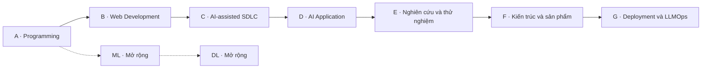

# Roadmap theo Phase A–G

**Mục tiêu:** nắm kiến thức để tự xây, giải thích, kiểm thử và vận hành một ứng dụng AI. Giữ bảy phase của [mindmap gốc](https://app.xmind.com/share/qQDQBpop?xid=59C374nV), chia nhỏ bên trong để biết chính xác từng phần cần học.

**Cách đọc:** Phase → phần kiến thức → topics/concepts → bài thực hành → output → review. Các mục bên dưới xác định phạm vi cần nắm; tên framework chỉ là công cụ áp dụng. `A.1` là phần kiến thức trong Phase A; `A1` là mã course có đề bài và nguồn đọc, không phải hai phase khác nhau.

## Tổng quan

| Phase | Khối kiến thức | Các phần bên trong | Giờ tham chiếu |
| --- | --- | --- | ---: |
| [A](#phase-a) | Programming Language — Python | Python nền tảng → nâng cao → async → kiểm thử → thư viện dữ liệu | 50–75 |
| [B](#phase-b) | Web Development — Database, Backend và Frontend | Internet/OS → Database → FastAPI → JavaScript/TypeScript → React/Next.js | 105–155 |
| [C](#phase-c) | AI-assisted Software Development | Concept AI → yêu cầu/spec → quy trình phát triển → review và CI | 30–45 |
| [D](#phase-d) | AI Application — LLM, RAG và Agent Systems | LLM → kiến trúc ứng dụng AI → RAG → Agent/MCP → đánh giá và bảo vệ hệ thống | 100–155 |
| [E](#phase-e) | Nghiên cứu dự án và thiết kế thử nghiệm | Xác định bài toán → thiết kế so sánh → phân tích → quyết định phạm vi | 20–35 |
| [F](#phase-f) | Kiến trúc, tích hợp và xây dựng sản phẩm | Thiết kế phạm vi/kiến trúc → tích hợp → kiểm thử → review và bàn giao | 45–70 |
| [G](#phase-g) | Deployment, DevOps và LLMOps | Linux/Container → Cloud/IaC → CI/CD → Observability/SRE → LLMOps | 55–85 |

Đây là thứ tự học chính. Git, test, bảo mật và cách kiểm code AI bắt đầu từ A/B; C học quy trình có hệ thống. Brief bài tập được viết từ đầu, E đào sâu kiểm chứng bài toán sau khi có prototype. Linux/network học nền ở B rồi vận hành ở G. Không cần chờ đến phase sau mới áp dụng những việc này.

## Thế nào là nắm hết một phase?

Hoàn thành **toàn bộ kiến thức bắt buộc trong phạm vi liệt kê**, ở độ sâu đã ghi, cùng bài thực hành và điều kiện kết thúc. Mỗi mục cần giải thích bằng ví dụ, áp dụng đúng và xử lý một biến thể; các mục nhận biết cần giải thích mục đích, giới hạn và khi nào dùng. Phần mở rộng được ghi riêng, không mặc định phải học hết mọi tính năng của một ngôn ngữ/framework.

- Mỗi phần kiến thức có bài làm hoặc bằng chứng tương đương, trỏ tới file/commit và review.
- Output chạy lại được; kiểm ca hợp lệ, biên và lỗi quan trọng.
- Giải thích được code, kể cả phần AI hỗ trợ, và sửa được yêu cầu nhỏ mới.
- Mọi phần bắt buộc đều đạt; không lấy điểm trung bình hay số giờ để bù phần còn thiếu.

Checklist dưới đây là **phạm vi học**. Trạng thái và bằng chứng nằm trong [tracker theo phần kiến thức](progress/PHASES.md); đối chiếu CLO/PLO ở [tiến độ](PROGRESS.md). Bài cũ đáp ứng yêu cầu có thể đem review để rút phần ôn.

## Phase A — Programming Language — Python

**Đầu vào:** Đọc được code Python cơ bản; nếu chưa có bài làm, bắt đầu bằng bài đối chiếu đầu vào.

Nếu còn thiếu nền tảng, học A.1 trước và điều chỉnh số giờ; không dùng yêu cầu đầu vào để bỏ qua lỗ hổng kiến thức.

### A.1 · Python nền tảng

- [ ] Biến, kiểu dữ liệu và toán tử: số, chuỗi, boolean, None; chuyển kiểu, truthiness và so sánh.
- [ ] Cấu trúc điều khiển và hàm: if/else, for/while, tham số, giá trị trả về, scope và xử lý trường hợp biên.
- [ ] Cấu trúc dữ liệu: list, tuple, dict, set; indexing/slicing, comprehension; chọn cấu trúc phù hợp để tra cứu, nhóm và loại trùng.
- [ ] Mô hình dữ liệu Python: mutable/immutable, reference, shallow/deep copy, equality/identity; tránh sửa input ngoài ý muốn.
- [ ] File và lỗi: đọc/ghi CSV/JSON, encoding, đường dẫn; try/except/finally, raise và traceback.

**Thực hành:** Viết hàm chuẩn hóa danh sách địa điểm, xử lý rỗng/trùng/sai kiểu và chứng minh dữ liệu gốc không đổi.

**Bài học và nguồn:** [A1 · Python Programming và testing](learning-path/ai-application-engineer/programs/a-python/courses/python-programming/README.md).

### A.2 · OOP và Advanced Python

- [ ] Class/object, instance/class attribute, method, constructor và dataclass; mô hình hóa dữ liệu có trách nhiệm rõ.
- [ ] Encapsulation, inheritance và composition: giải thích khi nào dùng từng cách bằng ví dụ nhỏ.
- [ ] Module/package/import, chia file và tách logic xử lý khỏi I/O.
- [ ] Iterable/iterator/generator, lazy evaluation, closure và decorator; đọc được luồng thực thi.
- [ ] Context manager và quản lý tài nguyên; type hints và giới hạn của kiểm kiểu so với validation lúc chạy.

**Thực hành:** Refactor CLI thành reader/validator/reporter; đọc file qua generator, đóng tài nguyên khi lỗi và giải thích một decorator.

**Bài học và nguồn:** [A1 · Python Programming và testing](learning-path/ai-application-engineer/programs/a-python/courses/python-programming/README.md).

### A.3 · Concurrency và Async Python

- [ ] I/O-bound và CPU-bound; phân biệt concurrency với parallelism.
- [ ] Coroutine, event loop, async/await và task; nhận diện blocking I/O trong async code.
- [ ] Timeout, cancellation, propagation của lỗi và giới hạn số tác vụ đồng thời.
- [ ] Nhận biết vai trò thread/process; giải thích vì sao async không tự tăng tốc mọi phép tính.

**Thực hành:** So sánh xử lý metadata giả lập tuần tự/đồng thời; thêm tác vụ chậm/lỗi và kiểm giới hạn concurrency.

**Bài học và nguồn:** [A1 · Python Programming và testing](learning-path/ai-application-engineer/programs/a-python/courses/python-programming/README.md).

### A.4 · Môi trường, debugging và testing

- [ ] Interpreter, virtual environment, cài dependency và ghi phiên bản để người khác dựng lại môi trường.
- [ ] Git tối thiểu: status, diff, add, commit; README có input và lệnh chạy.
- [ ] Đọc traceback, tái hiện lỗi, đặt giả thuyết và xác nhận nguyên nhân trước khi sửa.
- [ ] pytest, assert, fixture, test exception; ca hợp lệ, ca biên, ca lỗi và fake I/O.
- [ ] Phân biệt test kiểm contract với test chỉ lặp lại cách cài đặt; đọc và giải thích được code AI tạo.

**Thực hành:** Cài hai lỗi có chủ đích vào CLI, ghi test fail → sửa → pass; chạy lại từ môi trường mới.

**Bài học và nguồn:** [A1 · Python Programming và testing](learning-path/ai-application-engineer/programs/a-python/courses/python-programming/README.md).

### A.5 · Python Libraries for Data and AI

- [ ] NumPy: ndarray, shape, dtype, axis, indexing, broadcasting, vectorization và view/copy.
- [ ] Pandas: Series/DataFrame, đọc/ghi, lọc, missing values, duplicate, groupby và aggregate.
- [ ] Merge/join và cardinality: phát hiện nhân dòng ngoài dự kiến, đối chiếu số dòng và tổng.
- [ ] Matplotlib/Seaborn: Figure/Axes, chọn biểu đồ, nhãn/trục/đơn vị, phân bố và outlier.
- [ ] Data quality và provenance: schema, valid/reject, nguồn dữ liệu và khả năng chạy lại báo cáo.

**Thực hành:** Tạo clean.csv, rejects.csv, report.json và hai biểu đồ; đối chiếu với expected tính tay trên fixture nhỏ.

**Bài học và nguồn:** [A2 · Python Libraries for Data and AI](learning-path/ai-application-engineer/programs/a-python/courses/python-libraries/README.md).

**Output Phase A:** CLI và báo cáo dữ liệu địa điểm: đọc CSV/JSON, valid/reject theo dòng, thống kê và biểu đồ.

**Điều kiện kết thúc:** Hoàn thành các phần bắt buộc ở trên và chứng minh: Chạy lại trên fixture mới; input = accepted + rejected; không sửa file gốc; test phát hiện ít nhất hai lỗi được cài có chủ đích.

**Độ sâu và mở rộng:** Metaclass, descriptor chuyên sâu, CPython internals và tối ưu đa tiến trình lớn là mở rộng; không chặn đầu ra Python ứng dụng.

**Tra concept:** [python](concepts/python.md) · [data](concepts/data.md).

[PLO, courses và milestone Phase A](learning-path/ai-application-engineer/programs/a-python/README.md) · [Theo dõi từng phần](progress/PHASES.md)

## Phase B — Web Development — Database, Backend và Frontend

**Đầu vào:** A hoặc bài làm tương đương đã được review.

Học B.1 để có bức tranh request, B.2 để có dữ liệu, rồi B.3; hoàn thành nền HTML/CSS/JavaScript/TypeScript ở B.4 trước B.5.

### B.1 · Internet, Network và OS căn bản

- [ ] Client/server, browser, process, port và environment variable; request đi tới process nào.
- [ ] DNS, IP, TCP, TLS và HTTPS ở mức giải thích đường đi của request và chẩn đoán lỗi.
- [ ] HTTP request/response, method, status code, header, body, cookie và tính stateless.
- [ ] Origin, CORS, timeout và lỗi kết nối; phân biệt lỗi mạng, lỗi API và lỗi dữ liệu.
- [ ] Dùng terminal, curl, browser Network tab và log để lần theo một request.

**Thực hành:** Vẽ browser → DNS/TLS → API → DB; gửi request đúng/sai và phân biệt lỗi port, auth và validation.

**Bài học và nguồn:** [B2 · Internet Basics và FastAPI](learning-path/ai-application-engineer/programs/b-fullstack/courses/fastapi/README.md).

### B.2 · Database, SQL, ORM và NoSQL

- [ ] Relational modeling: bảng, quan hệ, PK/FK, UNIQUE/NOT NULL/CHECK, normalization và NULL.
- [ ] SQL: CRUD, WHERE, ORDER BY, JOIN, GROUP BY, HAVING, aggregate và pagination; kiểm nhóm rỗng và join cardinality.
- [ ] Transaction/ACID, isolation, race condition, rollback và optimistic locking.
- [ ] ORM: mapping, session/unit of work, migration, SQL được sinh và N+1 query.
- [ ] Index, composite index và EXPLAIN; đo trên cùng dữ liệu trước/sau tối ưu.
- [ ] NoSQL: document/key-value và trade-off; cache-aside, TTL, invalidation và nguồn dữ liệu chuẩn.

**Thực hành:** Thiết kế schema user/trip/place; truy vấn nhóm rỗng, tái hiện hai session sửa cùng dữ liệu và thử cache ngừng hoạt động.

**Bài học và nguồn:** [B1 · Database và Data Modeling](learning-path/ai-application-engineer/programs/b-fullstack/courses/database/README.md).

### B.3 · Backend và Web API với FastAPI

- [ ] REST: resource, endpoint, contract, validation, error response, filtering và pagination.
- [ ] FastAPI: routing, request/response model, dependency injection, exception handling và OpenAPI.
- [ ] Authentication/authorization, password hashing, token/session, kiểm quyền trên từng tài nguyên và tránh lộ secret.
- [ ] Tách router/service/data access theo nhu cầu; transaction boundary, idempotency và xử lý request lặp.
- [ ] Async API, timeout, retry có giới hạn, streaming/SSE, cancellation và disconnect.
- [ ] Unit/integration/contract test; kiểm API sai input, không có quyền và dependency bị lỗi.

**Thực hành:** Xây API CRUD có persistence và quyền; restart vẫn có dữ liệu, request lặp giữ effect đúng contract.

**Bài học và nguồn:** [B2 · Internet Basics và FastAPI](learning-path/ai-application-engineer/programs/b-fullstack/courses/fastapi/README.md).

### B.4 · Ngôn ngữ và nền tảng Web

- [ ] HTML semantic và form; CSS box model, Flexbox/Grid, responsive layout và trạng thái focus.
- [ ] JavaScript: biến, function, scope, array/object, destructuring, module/import và immutable update.
- [ ] Promise, async/await, fetch và xử lý lỗi; phân biệt logic trên browser với server.
- [ ] TypeScript: type/interface, union, optional field và narrowing; kiểu tĩnh không thay thế kiểm dữ liệu API lúc chạy.
- [ ] DOM/event, form validation và accessibility căn bản: label, keyboard và thông báo lỗi.

**Thực hành:** Làm form HTML/JS nhỏ gọi API trước khi chuyển sang React; giải thích request, state và lỗi validation.

**Bài học và nguồn:** [B3 · React, Next.js và Tailwind CSS](learning-path/ai-application-engineer/programs/b-fullstack/courses/frontend/README.md).

### B.5 · Frontend với React, Next.js và Tailwind CSS

- [ ] React: component, JSX, props/state, event, controlled form, key và quy tắc cập nhật state.
- [ ] Hooks thường dùng: useState, useEffect, useRef; dependency và cleanup khi có side effect.
- [ ] Next.js: routing, layout, Server/Client Components, data fetching và rendering; giữ secret ở server.
- [ ] Tailwind: utility classes, responsive layout; hiểu CSS mà utility đang biểu diễn.
- [ ] Luồng UI/API: loading, empty, error, success; submit lặp, lỗi mạng và dữ liệu sau refresh.
- [ ] Kiểm luồng người dùng bằng bàn phím và các trạng thái lỗi; phân biệt UI ẩn nút với kiểm quyền thật ở API.

**Thực hành:** Tạo list/detail/form nối API thật; demo tạo/sửa/xem, refresh, lỗi mạng và truy cập chéo người dùng.

**Bài học và nguồn:** [B3 · React, Next.js và Tailwind CSS](learning-path/ai-application-engineer/programs/b-fullstack/courses/frontend/README.md).

**Output Phase B:** Web quản lý địa điểm và lịch trình nháp với PostgreSQL, FastAPI, React/Next.js.

**Điều kiện kết thúc:** Hoàn thành các phần bắt buộc ở trên và chứng minh: Luồng tạo/sửa/xem chạy qua UI/API/DB; dữ liệu tồn tại sau restart; người dùng khác không đọc/sửa được dữ liệu riêng trong bộ test.

**Độ sâu và mở rộng:** GraphQL cần nhận biết schema/query/mutation và so sánh với REST; triển khai GraphQL hoặc nhiều hệ NoSQL chỉ khi bài toán cần.

**Tra concept:** [data](concepts/data.md) · [web](concepts/web.md) · [architecture](concepts/architecture.md).

[PLO, courses và milestone Phase B](learning-path/ai-application-engineer/programs/b-fullstack/README.md) · [Theo dõi từng phần](progress/PHASES.md)

## Phase C — AI-assisted Software Development

**Đầu vào:** Có một feature nhỏ từ B để review và sửa; có thể học cách ghi hỗ trợ AI ngay từ A.

### C.1 · Concept khi làm việc với AI

- [ ] Instruction, prompt, context và context window; phân biệt quy tắc với dữ liệu tham khảo.
- [ ] Memory, skill, hook và tool: vai trò, vòng đời và phần phụ thuộc công cụ.
- [ ] Cung cấp repo context, constraint, acceptance criteria và ví dụ; chia task có phạm vi kiểm được.
- [ ] Giới hạn của coding assistant: sai giả định, thiếu context, bịa API và sửa ngoài phạm vi.
- [ ] Đọc diff, giải thích code, chạy kiểm chứng và ghi rõ phần tự làm/AI hỗ trợ.

**Thực hành:** Cho AI hỗ trợ một thay đổi nhỏ; kiểm từng giả định, sửa một lỗi và ghi bằng chứng retest.

**Bài học và nguồn:** [C1 · Concept AI và làm việc với coding assistant](learning-path/ai-application-engineer/programs/c-ai-sdlc/courses/ai-coding/README.md).

### C.2 · SDLC, Spec-driven Development và Agile

- [ ] SDLC: requirement, design, implementation, testing, release và maintenance.
- [ ] Problem statement, user story, acceptance criteria, non-goal và Definition of Done.
- [ ] Spec-driven Development: spec → plan → tasks → implementation → verification; giữ trace từ yêu cầu đến test.
- [ ] ADR, dependency, risk và quyết định đánh đổi; cập nhật spec khi phạm vi thay đổi.
- [ ] Agile/Scrum: backlog, Sprint Goal, Increment và review; đọc Spec Kit/AWS AI-DLC như các cách tổ chức tham khảo.

**Thực hành:** Viết spec một feature, nêu ca bị từ chối và hai phương án thiết kế; nối từng tiêu chí nghiệm thu với cách kiểm.

**Bài học và nguồn:** [C2 · SDLC, Spec-driven Development và CI](learning-path/ai-application-engineer/programs/c-ai-sdlc/courses/spec-driven/README.md).

### C.3 · Git workflow, code review và CI

- [ ] Branch, commit, diff, PR và conflict; chia thay đổi đủ nhỏ để review.
- [ ] Code review: contract, correctness, readability, quyền dữ liệu, test và phạm vi thay đổi.
- [ ] CI: trigger, workflow, job, step, runner, artifact và kết quả kiểm tra.
- [ ] Regression, bug report, test fail/pass và release note; không lấy CI xanh thay cho mọi kiểm chứng.

**Thực hành:** Đưa feature từ spec đến review; làm một CI job fail có chủ đích, đọc log, sửa và chạy lại.

**Bài học và nguồn:** [C2 · SDLC, Spec-driven Development và CI](learning-path/ai-application-engineer/programs/c-ai-sdlc/courses/spec-driven/README.md).

**Output Phase C:** Một thay đổi trên web được thực hiện từ spec đến review, với nhật ký đóng góp AI và kiểm chứng.

**Điều kiện kết thúc:** Hoàn thành các phần bắt buộc ở trên và chứng minh: Có yêu cầu, acceptance tests, diff, bug note và kết quả retest; người học giải thích và sửa được code AI tạo.

**Độ sâu và mở rộng:** Cần hiểu skill/hook/Spec Kit/AI-DLC; không bắt buộc cài mọi công cụ hoặc áp dụng đầy đủ vai trò Scrum cho bài tập cá nhân.

**Tra concept:** [ai-sdlc](concepts/ai-sdlc.md) · [architecture](concepts/architecture.md).

[PLO, courses và milestone Phase C](learning-path/ai-application-engineer/programs/c-ai-sdlc/README.md) · [Theo dõi từng phần](progress/PHASES.md)

## Phase D — AI Application — LLM, RAG và Agent Systems

**Đầu vào:** B và C; thống kê đánh giá tối thiểu, vector/cosine được ôn trong D1.

### D.1 · LLM Fundamentals và kiến trúc model

- [ ] Token/tokenization, embedding, vector, dot product và cosine similarity; ví dụ tính tay nhỏ.
- [ ] Attention, Transformer, encoder, decoder và encoder-decoder ở mức giải thích vai trò.
- [ ] Pretraining, fine-tuning và inference; phân biệt thay đổi context với cập nhật weights.
- [ ] Context window, sampling, hallucination và giới hạn suy luận từ output model.
- [ ] Embedding model với generative model; chọn đúng loại model cho retrieval và generation.

**Thực hành:** Vẽ input → token → model → output, tính cosine trên vector nhỏ và giải thích hai loại model trong RAG.

**Bài học và nguồn:** [D1 · LLM Architecture và Integration](learning-path/ai-application-engineer/programs/d-ai-systems/courses/llm-integration/README.md).

### D.2 · AI Application Architecture và LLM Integration

- [ ] Ranh giới UI/API, business logic, model adapter, retrieval và tool; model là một thành phần của ứng dụng.
- [ ] Prompt/messages, structured output, schema validation và kiểm đúng nội dung bên cạnh đúng định dạng.
- [ ] Provider adapter, config/model version, timeout, rate limit, retry có giới hạn và fallback.
- [ ] State/context, token budget, latency và cost; phân biệt agent loop với harness thực thi.
- [ ] Mock/fake provider và contract test để kiểm cả timeout, output sai và trường thiếu.

**Thực hành:** Tạo adapter trích thông tin vào schema; dùng fake provider cho ca lỗi rồi đo provider thật khi có ngân sách.

**Bài học và nguồn:** [D1 · LLM Architecture và Integration](learning-path/ai-application-engineer/programs/d-ai-systems/courses/llm-integration/README.md).

### D.3 · RAG System

- [ ] Ingestion: parsing, OCR, vision, table extraction; nguồn/phiên bản/page/span, reject và incremental update/delete.
- [ ] Chunking: kích thước, overlap, ranh giới ngữ nghĩa và metadata; theo dõi tác động tới retrieval.
- [ ] Embedding/indexing: biểu diễn vector, index và cập nhật; giữ quyền truy cập cùng dữ liệu.
- [ ] Retrieval: lexical/BM25, dense/vector, hybrid, top-k, RRF và reranker; có baseline trước khi tối ưu.
- [ ] Generation: context assembly, grounding, citation, supported claim, abstention và xử lý nguồn mâu thuẫn/cũ.
- [ ] Tách lỗi ingestion, retrieval/ranking và generation; đo từng tầng trên cùng query/evidence set.

**Thực hành:** Xây pipeline từ tài liệu đến câu trả lời có nguồn; kiểm ca thiếu/mâu thuẫn nguồn và so sánh retrieval với baseline.

**Bài học và nguồn:** [D2 · Ingestion, Retrieval và RAG](learning-path/ai-application-engineer/programs/d-ai-systems/courses/rag/README.md).

### D.4 · Agent System, Tool và MCP

- [ ] Workflow với agent; observe/decide/act, stop condition và khi nào luồng cố định đã đủ.
- [ ] Harness: tool registry/schema, validation, permission, execution, trace và giới hạn bước/thời gian/chi phí.
- [ ] State machine, checkpoint/resume, memory và idempotency; không lặp effect đã commit.
- [ ] Human-in-the-loop, approval gắn với payload, least privilege và audit trail.
- [ ] MCP: host/client/server, tools/resources/prompts và auth boundary; giao thức không tự cấp quyền.
- [ ] Tool timeout/unknown tool/args sai; đánh giá task success và chi phí so với workflow đơn giản.

**Thực hành:** Làm agent nhỏ với tool chỉ đọc; thêm checkpoint và bài lab duyệt thao tác ghi, rồi thử restart/resume.

**Bài học và nguồn:** [D3 · Agent Loop, Harness và MCP](learning-path/ai-application-engineer/programs/d-ai-systems/courses/agents/README.md).

### D.5 · Đánh giá kỹ thuật và an toàn ứng dụng AI

- [ ] Baseline, dev/test split, rubric, sample size và version của model/prompt/data.
- [ ] Retrieval recall/rank, answer correctness/grounding và task success; tách chất lượng khỏi latency/cost.
- [ ] Prompt injection trong tài liệu/tool output, trust boundary và kiểm quyền trước khi đưa dữ liệu vào context.
- [ ] Negative tests: thiếu bằng chứng, truy cập chéo, tool vượt quyền, vòng lặp và vượt budget.
- [ ] Error analysis, p50/p95 và token/cost; ghi cả trường hợp AI thua giải pháp đơn giản.

**Thực hành:** Nộp bảng so sánh cùng tập input, trace lỗi và tests quyền/budget; một citation phải truy về đoạn thật sự hỗ trợ claim.

**Bài học và nguồn:** [D1 · LLM Architecture và Integration](learning-path/ai-application-engineer/programs/d-ai-systems/courses/llm-integration/README.md) · [D2 · Ingestion, Retrieval và RAG](learning-path/ai-application-engineer/programs/d-ai-systems/courses/rag/README.md) · [D3 · Agent Loop, Harness và MCP](learning-path/ai-application-engineer/programs/d-ai-systems/courses/agents/README.md).

**Output Phase D:** Prototype hỏi đáp dữ liệu du lịch có nguồn, kèm agent chỉ đọc hoặc đề xuất thay đổi để người dùng duyệt.

**Điều kiện kết thúc:** Hoàn thành các phần bắt buộc ở trên và chứng minh: Có baseline, split/rubric cố định, citation truy về nguồn, negative tests quyền và tool budget; kết quả nêu cả ca thất bại.

**Độ sâu và mở rộng:** Kiến trúc model học ở mức giải thích và tích hợp. Huấn luyện Transformer từ đầu, fine-tuning và multi-agent chuyên sâu là mở rộng.

**Tra concept:** [llm](concepts/llm.md) · [rag](concepts/rag.md) · [agents](concepts/agents.md) · [evaluation](concepts/evaluation.md).

[PLO, courses và milestone Phase D](learning-path/ai-application-engineer/programs/d-ai-systems/README.md) · [Theo dõi từng phần](progress/PHASES.md)

## Phase E — Nghiên cứu dự án và thiết kế thử nghiệm

**Đầu vào:** D hoặc một prototype nhỏ đủ để kiểm giả thuyết; câu hỏi bài toán được ghi từ đầu A.

### E.1 · Problem Framing và dữ liệu

- [ ] Người dùng, nhiệm vụ, cách làm hiện tại, constraint và kết quả cần cải thiện.
- [ ] Phân biệt fact, observation, assumption, hypothesis và unknown; gắn nguồn bằng chứng.
- [ ] Khả năng thu thập, quyền sử dụng, chất lượng và giới hạn dữ liệu.
- [ ] Problem statement, câu hỏi thử nghiệm, baseline và non-goal.

**Thực hành:** Viết brief một bài toán cụ thể; ghi điều đã biết/chưa biết và bằng chứng cần thu trước khi mở rộng sản phẩm.

**Bài học và nguồn:** [E1 · Problem Discovery và Experimental Design](learning-path/ai-application-engineer/programs/e-research/courses/project-research/README.md).

### E.2 · Experimental Design

- [ ] Giả thuyết có thể bị bác bỏ, outcome metric và điều kiện tiếp tục/dừng đặt trước khi đo.
- [ ] Task set, dataset manifest, dev/test split và leakage; điều kiện tái lập.
- [ ] Controlled comparison và ablation: cùng input, cùng rubric, chỉ rõ thành phần thay đổi.
- [ ] Sample size, yếu tố gây nhiễu, tính đại diện và giới hạn kết luận.

**Thực hành:** Chốt protocol rồi so sánh baseline/candidate trên cùng task; không dùng test để chọn cấu hình.

**Bài học và nguồn:** [E1 · Problem Discovery và Experimental Design](learning-path/ai-application-engineer/programs/e-research/courses/project-research/README.md).

### E.3 · Phân tích kết quả và lựa chọn dự án

- [ ] Error taxonomy, failure cases và kết quả theo nhóm; tránh chỉ nhìn điểm trung bình.
- [ ] Trade-off quality/latency/cost, data/compute và tính khả thi.
- [ ] Phân biệt kết quả đã chạy, dự kiến và NOT_TESTED; báo cáo cả thử nghiệm không cải thiện.
- [ ] Decision note go/revise/stop, phạm vi MVP và acceptance criteria có bằng chứng hỗ trợ.

**Thực hành:** Nộp báo cáo ngắn và quyết định giữ/bỏ feature; thiếu dữ liệu thì nêu phép đo còn cần thay vì kết luận đã xác nhận.

**Bài học và nguồn:** [E1 · Problem Discovery và Experimental Design](learning-path/ai-application-engineer/programs/e-research/courses/project-research/README.md).

**Output Phase E:** Project brief, evidence matrix và báo cáo thử nghiệm quyết định phạm vi sản phẩm.

**Điều kiện kết thúc:** Hoàn thành các phần bắt buộc ở trên và chứng minh: Có bài toán, nguồn dữ liệu, baseline, phép đo, kết quả hoặc UNKNOWN; quyết định không dựa riêng vào demo đẹp.

**Độ sâu và mở rộng:** Phạm vi là nghiên cứu ứng dụng có thử nghiệm; không tự gọi một benchmark nhỏ là đóng góp khoa học đã được xác nhận.

**Tra concept:** [evaluation](concepts/evaluation.md) · [ai-sdlc](concepts/ai-sdlc.md).

[PLO, courses và milestone Phase E](learning-path/ai-application-engineer/programs/e-research/README.md) · [Theo dõi từng phần](progress/PHASES.md)

## Phase F — Kiến trúc, tích hợp và xây dựng sản phẩm

**Đầu vào:** E đã chốt phạm vi; B–D có bằng chứng tương ứng với feature chọn.

### F.1 · Software Design và kế hoạch sản phẩm

- [ ] MVP, user flow, task breakdown, dependency, risk và Definition of Done.
- [ ] Ranh giới module/component, contract và data flow từ frontend qua backend tới DB/AI.
- [ ] Separation of concerns, dependency injection và adapter; chọn pattern để giải quyết vấn đề cụ thể.
- [ ] ADR cho phương án thiết kế, tính nhất quán dữ liệu, quyền và failure path.

**Thực hành:** Vẽ kiến trúc một luồng chính, lập backlog theo dependency và ghi quyết định thiết kế gắn acceptance criteria.

**Bài học và nguồn:** [F1 · MVP Implementation và Product Review](learning-path/ai-application-engineer/programs/f-product/courses/product-delivery/README.md).

### F.2 · System Integration và kiểm thử sản phẩm

- [ ] Tích hợp UI/API/database/retrieval/model theo contract và cấu hình môi trường.
- [ ] Unit/integration/contract/E2E tests; chọn ca kiểm cho luồng chính và ranh giới hệ thống.
- [ ] Authorization, validation và deterministic rules cho số học/ràng buộc; AI chỉ đề xuất trong phạm vi.
- [ ] Fallback/degraded state, feature config, timeout và dữ liệu thiếu; người dùng biết kết quả đang ở trạng thái nào.
- [ ] Regression, triage lỗi và release candidate có version.

**Thực hành:** Giao một luồng end-to-end; gây lỗi provider, quyền và dữ liệu, sửa lỗi rồi bổ sung regression test.

**Bài học và nguồn:** [F1 · MVP Implementation và Product Review](learning-path/ai-application-engineer/programs/f-product/courses/product-delivery/README.md).

### F.3 · Product Review, tài liệu và Ownership

- [ ] Task-based review, feedback, mức nghiêm trọng của lỗi và quyết định ưu tiên.
- [ ] README dựng/chạy, cấu hình mẫu, demo, changelog và giới hạn đã biết.
- [ ] Bàn giao artifact/commit, dữ liệu và kết quả kiểm chứng để người khác thực hiện lại task.
- [ ] Giải thích phần tự làm/AI hỗ trợ, trade-off và kết quả thực tế của thay đổi.

**Thực hành:** Để reviewer thực hiện task từ README; xử lý một phản hồi có bằng chứng và trình bày case study ngắn.

**Bài học và nguồn:** [F1 · MVP Implementation và Product Review](learning-path/ai-application-engineer/programs/f-product/courses/product-delivery/README.md).

**Output Phase F:** MVP có một luồng hoàn chỉnh và bộ bài nộp gồm demo, tests, ADR, README.

**Điều kiện kết thúc:** Hoàn thành các phần bắt buộc ở trên và chứng minh: Người khác thực hiện task từ README; critical path và negative tests đạt; quyết định giữ/bỏ feature dựa trên kết quả review.

**Độ sâu và mở rộng:** Ưu tiên một ứng dụng với ranh giới rõ. Microservices hoặc hệ phân tán quy mô lớn chỉ bổ sung khi có yêu cầu biện minh.

**Tra concept:** [architecture](concepts/architecture.md) · [web](concepts/web.md) · [evaluation](concepts/evaluation.md).

[PLO, courses và milestone Phase F](learning-path/ai-application-engineer/programs/f-product/README.md) · [Theo dõi từng phần](progress/PHASES.md)

## Phase G — Deployment, DevOps và LLMOps

**Đầu vào:** F có release candidate; Linux/process/network cơ bản được bắt đầu từ B.

### G.1 · Linux và Containerization

- [ ] Shell/bash, file permission, process, signal, environment variable và log.
- [ ] DNS/port/network trong môi trường deploy; phân biệt host với container.
- [ ] Docker: image, Dockerfile, container, build, volume và network.
- [ ] Compose: service/config/dependency, persistent storage và restart; secret tách khỏi image/Git.

**Thực hành:** Đóng gói app và DB bằng Compose; thử sai port/config, restart và kiểm dữ liệu còn nguyên.

**Bài học và nguồn:** [G1 · Linux, Container, Cloud và CI/CD](learning-path/ai-application-engineer/programs/g-delivery/courses/devops/README.md).

### G.2 · Cloud và Infrastructure as Code

- [ ] Compute, object storage, database, network và IAM trên một nhà cung cấp hoặc môi trường lab.
- [ ] Config/secret theo môi trường, least privilege, ngân sách và vòng đời tài nguyên.
- [ ] IaC/Terraform: khai báo hạ tầng, plan/apply, state và drift ở mức đọc/giải thích và bài lab phù hợp.
- [ ] Sơ đồ deployment, giới hạn tài nguyên và lý do chọn target; không phải học đồng thời AWS/Azure/GCP.

**Thực hành:** Chọn một target, viết ADR và kế hoạch hạ tầng/config; đọc plan trước khi thay đổi tài nguyên của lab.

**Bài học và nguồn:** [G1 · Linux, Container, Cloud và CI/CD](learning-path/ai-application-engineer/programs/g-delivery/courses/devops/README.md).

### G.3 · CI/CD, DevSecOps và phục hồi

- [ ] Pipeline test → build → deploy, artifact/version, staging, health/readiness và release checks.
- [ ] Quản lý secret, dependency và quyền của pipeline; kiểm bảo mật trong vòng phát triển.
- [ ] Rollback app/config, database migration và tương thích giữa phiên bản.
- [ ] Backup/restore và kiểm dữ liệu sau phục hồi; phân biệt rollback binary với đảo thay đổi dữ liệu.

**Thực hành:** Deploy một release và diễn tập rollback/restore; lưu log, phiên bản và kết quả kiểm sau phục hồi.

**Bài học và nguồn:** [G1 · Linux, Container, Cloud và CI/CD](learning-path/ai-application-engineer/programs/g-delivery/courses/devops/README.md).

### G.4 · Observability, SRE và reliability

- [ ] Structured log, metric, trace/span, correlation ID và bảo vệ dữ liệu trong log.
- [ ] SLI/SLO, p95, error budget, alert và runbook gắn với task người dùng.
- [ ] Retry/backoff, idempotency, DLQ, transactional outbox và reconciliation khi có background job.
- [ ] Incident, postmortem, failure injection và xử lý duplicate/timeout; retry không tự ngăn trùng effect.

**Thực hành:** Theo dấu một request API/retrieval/model, gây timeout/duplicate job và chứng minh cách phát hiện, phục hồi.

**Bài học và nguồn:** [G2 · Observability, SRE và LLMOps](learning-path/ai-application-engineer/programs/g-delivery/courses/llmops/README.md).

### G.5 · LLMOps/MLOps và vận hành AI

- [ ] Version model/prompt/data/index, evaluation regression và điều kiện promote/rollback.
- [ ] Theo dõi chất lượng AI, latency, token usage, cost và hard budget; uptime chưa đủ.
- [ ] Serving, canary và theo dõi thay đổi dữ liệu/chất lượng; kiểm trên tập eval cố định.
- [ ] Phân biệt DevOps, LLMOps và MLOps; training pipeline thuộc nhánh ML/DL khi dự án cần.
- [ ] Nhận biết AIOps/ChatOps: tự động hóa trong phạm vi quyền, có audit và điểm người dùng duyệt.

**Thực hành:** Đổi prompt/model trong lab, chạy eval trước/sau và quay về cấu hình cũ khi chạm điều kiện rollback.

**Bài học và nguồn:** [G2 · Observability, SRE và LLMOps](learning-path/ai-application-engineer/programs/g-delivery/courses/llmops/README.md).

**Output Phase G:** Bản release trên một môi trường được chọn, CI/CD, dashboard/report vận hành, backup/restore và runbook.

**Điều kiện kết thúc:** Hoàn thành các phần bắt buộc ở trên và chứng minh: Có bằng chứng deploy/health, rollback app/config và restore dữ liệu thử nghiệm; monitor chất lượng AI ngoài uptime; chưa triển khai thì ghi NOT_TESTED.

**Độ sâu và mở rộng:** Kubernetes/GitOps cần nhận biết mục đích, orchestration và drift; triển khai cluster là mở rộng. Chọn một cloud target, giữ AIOps/ChatOps trong phạm vi quyền.

**Tra concept:** [operations](concepts/operations.md).

[PLO, courses và milestone Phase G](learning-path/ai-application-engineer/programs/g-delivery/README.md) · [Theo dõi từng phần](progress/PHASES.md)

## ML và DL trong lộ trình

Mindmap đồng thời có khung AI Engineering gồm Python/Libraries, Data/SQL, ML, DL, AI Application và System Delivery. Repo giữ đủ những nhóm đó, nhưng lấy AI Application làm hướng chính theo mục tiêu đã chọn.

| Chương trình mở rộng | Học khi nào | Output |
| --- | --- | --- |
| [Machine Learning Foundations](learning-path/ai-application-engineer/programs/ml-foundations/README.md) | A2; học khi muốn đi sâu model hoặc khi giả thuyết dự án yêu cầu. | Mô hình phân loại dữ liệu mẫu công khai hoặc tổng hợp, kèm model card và evaluation. |
| [Deep Learning và Model Adaptation](learning-path/ai-application-engineer/programs/dl-foundations/README.md) | ML hoặc năng lực tương đương; chọn bài nhỏ phù hợp tài nguyên. | Thử nghiệm nhận diện ảnh nhỏ hoặc thích nghi model cho dữ liệu mẫu, kèm benchmark và model card. |

Training từ đầu, transfer learning, fine-tuning và gọi model API là các hoạt động khác nhau. Một bài tích hợp AI không bắt buộc phải tự huấn luyện model. Ngược lại, nếu chọn đầu ra về model, phải bổ sung dữ liệu/split/compute/evaluation tương ứng.

## Phân bổ thời gian

Nhánh chính hiện ước lượng **405–620 giờ**. Với giả định 15 giờ/tuần, tương đương khoảng **27–42 tuần**, chưa cộng tuần gián đoạn hoặc phạm vi mới. Các phần nhỏ dùng chung ngân sách của course, không cộng lại thành giờ mới. Nền Python hoặc HTML/CSS/JavaScript còn thiếu cần được ước lượng thêm sau đối chiếu đầu vào. Khoảng giờ gồm học, thực hành, kiểm thử và review; cần hiệu chỉnh sau hai buổi đầu và sau mỗi gate. Hai nhánh ML/DL tính riêng.

Ví dụ 1 tuần cho Python và 2 tuần cho Libraries trong mindmap là ví dụ tổ chức course, không phải lịch đã xác nhận phù hợp cho mọi đầu vào. Không cộng thêm 288 giờ của dashboard cũ vào tổng này vì nội dung có giao nhau.

Nếu có mốc 6 tháng, chốt ngân sách giờ và chọn phạm vi tối thiểu dựa trên bài đầu vào; không tự nén toàn bộ nội dung rồi gọi là đã đạt.

## Mức độ học

- **CORE:** tự giải thích và áp dụng đúng trong bài tập.
- **PRACTICE:** có bài làm và kiểm tra thể hiện cách dùng.
- **AWARENESS:** nhận biết mục đích, điều kiện dùng và trade-off.
- **OPTIONAL:** học sâu khi dự án hoặc hướng nghề nghiệp cần; chưa chọn không chặn gate nhánh chính.

Xem [concept thường dùng](docs/CONCEPTS.md), [course và nguồn](learning-path/ai-application-engineer/README.md), [tiến độ](PROGRESS.md).
