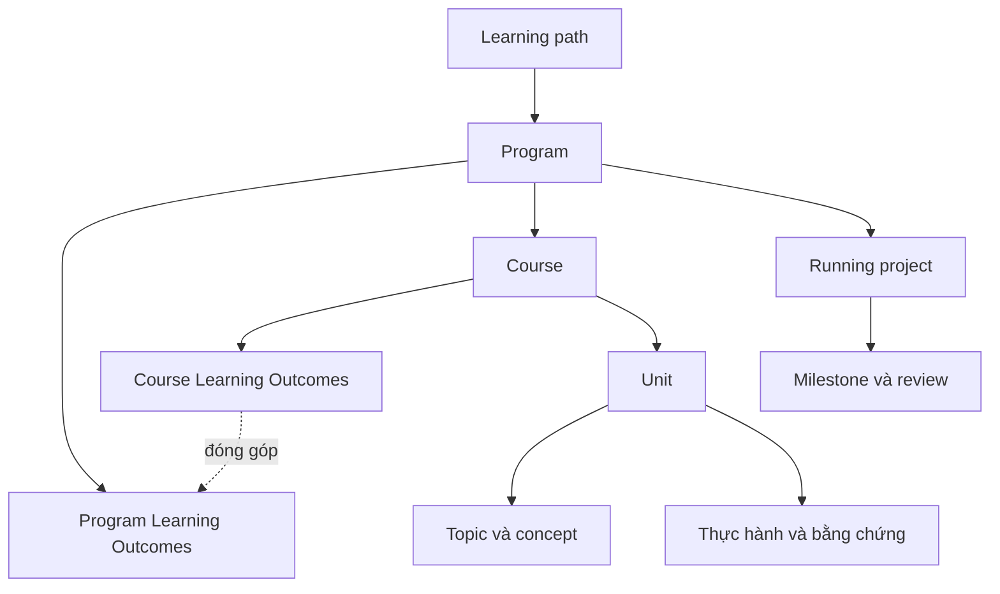

# Mindmap của learning path

Bản outline được chuẩn hóa từ các nhánh lộ trình và cấu trúc học trong [mindmap gốc](https://app.xmind.com/share/qQDQBpop?xid=59C374nV). Đây là nội dung Markdown trong repo; chưa chỉnh file trên Xmind.

## Cấu trúc học

## Outline theo giai đoạn

### A · Python Programming for AI

- [Python Programming và testing](../learning-path/ai-application-engineer/programs/a-python/courses/python-programming/README.md)
  - Dữ liệu và contract: list/dict/set; mutability; equality/identity; hàm; exception; type hint.
  - Tổ chức code và tính năng Python: module/package; scope/closure; iterator/generator; decorator; context manager; dataclass; composition.
  - Async và kiểm chứng: coroutine/task; event loop; I/O-bound/CPU-bound; timeout; cancellation; concurrency limit.
- [Python Libraries for Data and AI](../learning-path/ai-application-engineer/programs/a-python/courses/python-libraries/README.md)
  - NumPy và phép tính: ndarray; shape/dtype; broadcasting; vectorization; view/copy.
  - Pandas và chất lượng dữ liệu: DataFrame; missing values; groupby; merge; deduplication; schema.
  - Biểu đồ và báo cáo: Matplotlib Figure/Axes; Seaborn distribution; aggregation; units; outlier.
- Output program: CLI và báo cáo dữ liệu địa điểm: đọc CSV/JSON, valid/reject theo dòng, thống kê và biểu đồ.

### B · Data và Full-stack Web Development

- [Database và Data Modeling](../learning-path/ai-application-engineer/programs/b-fullstack/courses/database/README.md)
  - SQL và mô hình dữ liệu: PK/FK; UNIQUE/CHECK/NOT NULL; normalization; JOIN; aggregate; NULL.
  - Transaction và ORM: ACID; isolation; race condition; optimistic locking; migration; ORM session; N+1.
  - Index và NoSQL: EXPLAIN; composite index; document/key-value; TTL; invalidation; cache-aside.
- [Internet Basics và FastAPI](../learning-path/ai-application-engineer/programs/b-fullstack/courses/fastapi/README.md)
  - HTTP và contract: DNS; TCP/TLS; port; process; HTTP methods/status; headers; REST; OpenAPI.
  - Auth và persistence: authentication/authorization; session/token; object-level access; ORM; DI; idempotency.
  - Giao tiếp và lỗi mạng: timeout; retry/backoff; connection pool; pagination; SSE/WebSocket; GraphQL schema.
- [React, Next.js và Tailwind CSS](../learning-path/ai-application-engineer/programs/b-fullstack/courses/frontend/README.md)
  - React và trạng thái: JavaScript modules; Promise; TypeScript; component; props/state; controlled form; keys.
  - Next.js và API: routing/layout; Server/Client Components; data fetching; SSR/CSR; hydration; auth boundary.
  - Trải nghiệm và Tailwind: utility class; responsive; semantic HTML; focus; loading/empty/error; accessibility.
- Output program: Web quản lý địa điểm và lịch trình nháp với PostgreSQL, FastAPI, React/Next.js.

### C · AI trong quy trình phát triển phần mềm

- [Concept AI và làm việc với coding assistant](../learning-path/ai-application-engineer/programs/c-ai-sdlc/courses/ai-coding/README.md)
  - Prompt và context: instruction; prompt; context window; example; retrieved context; context budget.
  - Memory, skill và hook: persistent memory; reusable skill; tool; lifecycle hook; permission.
  - Review và sửa code AI: diff review; test oracle; negative test; regression; provenance; human-in-the-loop.
- [SDLC, Spec-driven Development và CI](../learning-path/ai-application-engineer/programs/c-ai-sdlc/courses/spec-driven/README.md)
  - Yêu cầu và thiết kế: problem statement; user story; acceptance criteria; non-goal; ADR; dependency.
  - Quy trình có AI: Spec-driven Development; AWS AI-DLC; backlog; Sprint Goal; Definition of Done.
  - Git, CI và review: branch/commit/PR; code review; CI job/artifact; regression; release note.
- Output program: Một thay đổi trên web được thực hiện từ spec đến review, với nhật ký đóng góp AI và kiểm chứng.

### D · AI Application, RAG và Agent Systems

- [LLM Architecture và Integration](../learning-path/ai-application-engineer/programs/d-ai-systems/courses/llm-integration/README.md)
  - Model và biểu diễn: tokenization; vector/cosine; attention; Transformer; encoder; decoder; pretraining/inference.
  - Provider adapter: prompt/messages; structured output; schema validation; timeout; fallback; rate limit.
  - Đánh giá tích hợp: baseline; dev/test; exact match/rubric; p50/p95; token usage; cost; model version.
- [Ingestion, Retrieval và RAG](../learning-path/ai-application-engineer/programs/d-ai-systems/courses/rag/README.md)
  - Tài liệu thành record: parsing; OCR; vision; table extraction; metadata; provenance; incremental ingestion.
  - Tìm kiếm có đánh giá: chunking/overlap; embedding; BM25; vector index; hybrid; RRF; top-k; reranker; ACL.
  - Sinh câu trả lời và kiểm chứng: grounding; citation; supported claim; abstention; stale evidence; context budget; prompt injection.
- [Agent Loop, Harness và MCP](../learning-path/ai-application-engineer/programs/d-ai-systems/courses/agents/README.md)
  - Loop và harness: observe/decide/act; workflow vs agent; harness; tool schema; stop condition.
  - State và hành động: state machine; checkpoint; resume; idempotency; HITL; least privilege; audit trail.
  - MCP và đo hiệu quả: MCP host/client/server; tools/resources/prompts; auth boundary; protocol; task success.
- Output program: Prototype hỏi đáp dữ liệu du lịch có nguồn, kèm agent chỉ đọc hoặc đề xuất thay đổi để người dùng duyệt.

### E · Nghiên cứu và lựa chọn dự án

- [Problem Discovery và Experimental Design](../learning-path/ai-application-engineer/programs/e-research/courses/project-research/README.md)
  - Bài toán và dữ liệu: user/task; current workflow; constraint; assumption; evidence; data rights.
  - Thiết kế thử nghiệm: baseline; dataset split; leakage; controlled comparison; ablation; outcome metric.
  - Ra quyết định: error taxonomy; latency/cost; failure cases; feasibility; go/revise/stop.
- Output program: Project brief, evidence matrix và báo cáo thử nghiệm quyết định phạm vi sản phẩm.

### F · Xây dựng sản phẩm và Ownership

- [MVP Implementation và Product Review](../learning-path/ai-application-engineer/programs/f-product/courses/product-delivery/README.md)
  - Scope và kế hoạch: MVP; user flow; task breakdown; dependency; risk; ADR; DoD.
  - Tích hợp end-to-end: contract test; E2E; authorization; validation; fallback; feature config.
  - Review và bàn giao: feedback; bug triage; regression; changelog; runbook; ownership.
- Output program: MVP có một luồng hoàn chỉnh và bộ bài nộp gồm demo, tests, ADR, README.

### G · Deployment, DevOps và LLMOps

- [Linux, Container, Cloud và CI/CD](../learning-path/ai-application-engineer/programs/g-delivery/courses/devops/README.md)
  - Linux và container: shell/bash; process; permissions; env; DNS/port; image/container; volume/network; Compose.
  - CI/CD và cloud: workflow; build artifact; immutable version; staging; secret; cloud compute/storage/IAM; IaC plan/state.
  - Phục hồi và mở rộng: health/readiness; rollback; backup/restore; migration; Kubernetes; GitOps; drift.
- [Observability, SRE và LLMOps](../learning-path/ai-application-engineer/programs/g-delivery/courses/llmops/README.md)
  - Quan sát hệ thống: structured log; metric; trace/span; correlation ID; SLI/SLO; p95; error budget.
  - LLMOps và MLOps: prompt/model/data version; eval regression; serving; drift; token/cost; hard budget; canary.
  - Reliability và vận hành: retry/backoff; DLQ; idempotency; transactional outbox; reconciliation; incident; AIOps/ChatOps.
- Output program: Bản release trên một môi trường được chọn, CI/CD, dashboard/report vận hành, backup/restore và runbook.

### ML · Machine Learning Foundations — mở rộng

- [Math for Machine Learning](../learning-path/ai-application-engineer/programs/ml-foundations/courses/math/README.md)
  - Đại số tuyến tính: vector; matrix; dot product; norm; cosine; projection.
  - Xác suất và thống kê: mean/median; variance; distribution; conditional probability; sampling.
  - Loss và tối ưu: objective; derivative; gradient descent; learning rate; convergence.
- [Machine Learning và Evaluation](../learning-path/ai-application-engineer/programs/ml-foundations/courses/classical-ml/README.md)
  - Dữ liệu và baseline: label; feature; split; leakage; preprocessing; baseline.
  - Fit và chọn model: pipeline; fit/transform; linear/tree model; cross-validation; hyperparameter.
  - Đóng gói và giải thích: confusion matrix; threshold; error analysis; model card; inference contract.
- Output program: Mô hình phân loại dữ liệu mẫu công khai hoặc tổng hợp, kèm model card và evaluation.

### DL · Deep Learning và Model Adaptation — mở rộng

- [Neural Networks và PyTorch](../learning-path/ai-application-engineer/programs/dl-foundations/courses/neural-networks/README.md)
  - Tensor và autograd: tensor/device; computation graph; backward; gradient; optimizer.
  - Training loop: Dataset/DataLoader; batch/epoch; loss; train/eval mode; checkpoint.
  - Generalization: overfitting; regularization; dropout; augmentation; early stopping.
- [Computer Vision và Fine-tuning](../learning-path/ai-application-engineer/programs/dl-foundations/courses/adaptation/README.md)
  - Chọn cách thích nghi: pretrained; frozen backbone; classifier head; transfer learning; data quality.
  - Thử nghiệm có giới hạn: fine-tuning; learning rate; batch size; compute budget; adapter/LoRA ở mức nhận biết.
  - Inference và bàn giao: export/checkpoint; batching; quantization; distillation; model card; license.
- Output program: Thử nghiệm nhận diện ảnh nhỏ hoặc thích nghi model cho dữ liệu mẫu, kèm benchmark và model card.

## Cách dùng

Dùng outline này để review cấu trúc hoặc làm nội dung tạo mindmap mới. Không coi đây là file `.xmind` đã import/render thành công. Nội dung chi tiết và tiến độ chính vẫn ở Markdown.
