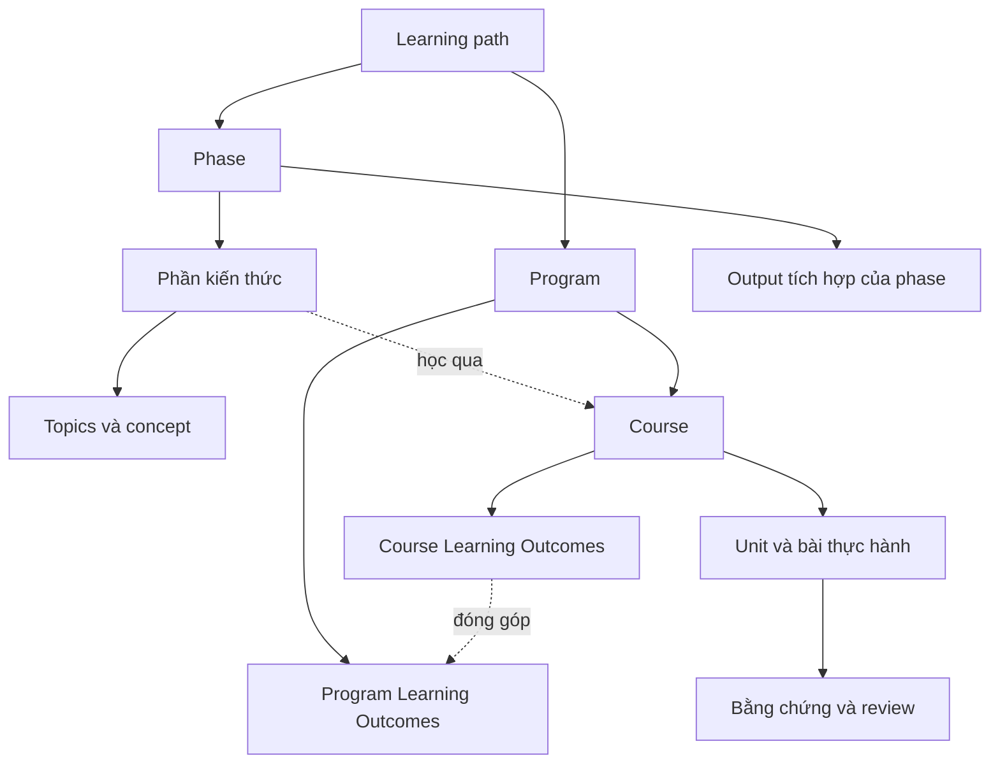

# Mindmap theo Phase A–G

Giữ khung từ [mindmap gốc](https://app.xmind.com/share/qQDQBpop?xid=59C374nV), chia nhỏ nội dung để học và review. Đây là outline trong repo; chưa chỉnh file Xmind.

## Cấu trúc học

## Outline kiến thức

### [Phase A · Programming Language — Python](../ROADMAP.md#phase-a)

- [A.1 · Python nền tảng](../ROADMAP.md#a-1)
- [A.2 · OOP và Advanced Python](../ROADMAP.md#a-2)
- [A.3 · Concurrency và Async Python](../ROADMAP.md#a-3)
- [A.4 · Môi trường, debugging và testing](../ROADMAP.md#a-4)
- [A.5 · Python Libraries for Data and AI](../ROADMAP.md#a-5)

### [Phase B · Web Development — Database, Backend và Frontend](../ROADMAP.md#phase-b)

- [B.1 · Internet, Network và OS căn bản](../ROADMAP.md#b-1)
- [B.2 · Database, SQL, ORM và NoSQL](../ROADMAP.md#b-2)
- [B.3 · Backend và Web API với FastAPI](../ROADMAP.md#b-3)
- [B.4 · Ngôn ngữ và nền tảng Web](../ROADMAP.md#b-4)
- [B.5 · Frontend với React, Next.js và Tailwind CSS](../ROADMAP.md#b-5)

### [Phase C · AI-assisted Software Development](../ROADMAP.md#phase-c)

- [C.1 · Concept khi làm việc với AI](../ROADMAP.md#c-1)
- [C.2 · SDLC, Spec-driven Development và Agile](../ROADMAP.md#c-2)
- [C.3 · Git workflow, code review và CI](../ROADMAP.md#c-3)

### [Phase D · AI Application — LLM, RAG và Agent Systems](../ROADMAP.md#phase-d)

- [D.1 · LLM Fundamentals và kiến trúc model](../ROADMAP.md#d-1)
- [D.2 · AI Application Architecture và LLM Integration](../ROADMAP.md#d-2)
- [D.3 · RAG System](../ROADMAP.md#d-3)
- [D.4 · Agent System, Tool và MCP](../ROADMAP.md#d-4)
- [D.5 · Đánh giá kỹ thuật và an toàn ứng dụng AI](../ROADMAP.md#d-5)

### [Phase E · Nghiên cứu dự án và thiết kế thử nghiệm](../ROADMAP.md#phase-e)

- [E.1 · Problem Framing và dữ liệu](../ROADMAP.md#e-1)
- [E.2 · Experimental Design](../ROADMAP.md#e-2)
- [E.3 · Phân tích kết quả và lựa chọn dự án](../ROADMAP.md#e-3)

### [Phase F · Kiến trúc, tích hợp và xây dựng sản phẩm](../ROADMAP.md#phase-f)

- [F.1 · Software Design và kế hoạch sản phẩm](../ROADMAP.md#f-1)
- [F.2 · System Integration và kiểm thử sản phẩm](../ROADMAP.md#f-2)
- [F.3 · Product Review, tài liệu và Ownership](../ROADMAP.md#f-3)

### [Phase G · Deployment, DevOps và LLMOps](../ROADMAP.md#phase-g)

- [G.1 · Linux và Containerization](../ROADMAP.md#g-1)
- [G.2 · Cloud và Infrastructure as Code](../ROADMAP.md#g-2)
- [G.3 · CI/CD, DevSecOps và phục hồi](../ROADMAP.md#g-3)
- [G.4 · Observability, SRE và reliability](../ROADMAP.md#g-4)
- [G.5 · LLMOps/MLOps và vận hành AI](../ROADMAP.md#g-5)

## Nhánh mở rộng về model

- [Machine Learning Foundations](../learning-path/ai-application-engineer/programs/ml-foundations/README.md): đại số tuyến tính, xác suất/thống kê, loss/tối ưu, dữ liệu/feature/label, model, split và evaluation.
- [Deep Learning và Model Adaptation](../learning-path/ai-application-engineer/programs/dl-foundations/README.md): tensor/autograd, neural network, training loop, regularization, computer vision, transfer learning và fine-tuning.

[Checklist đầy đủ](../ROADMAP.md) · [Danh mục concept](CONCEPTS.md) · [Bài tập/course/unit](../learning-path/ai-application-engineer/README.md) · [Tiến độ từng phần](../progress/PHASES.md)
