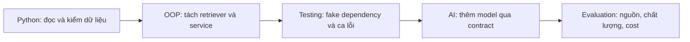

# Ôn nhanh trong 15–20 phút

[Mục lục bài học](README.md) · [Ghi phần còn quên](REVIEW.md)

Đọc từng dòng và thử giải thích bằng ví dụ. Dòng nào chưa giải thích được thì mở bài tương ứng; không cần đọc lại mọi bài với độ sâu như nhau.

## Python

| Nhớ điều này | Câu hỏi để tự kiểm | Bài |
| --- | --- | --- |
| Biến gắn với object; assignment không tự copy | Vì sao `b = a` rồi b.append làm a đổi? | [P01](python/01-data-and-objects.md) |
| List/tuple/dict/set có contract khác nhau | Cần giữ thứ tự và loại trùng thì thiết kế ra sao? | [P01](python/01-data-and-objects.md) |
| Copy nông còn chia sẻ object lồng | Copy dict có list bên trong đã độc lập chưa? | [P01](python/01-data-and-objects.md) |
| `==` khác `is`; falsy khác “không có dữ liệu” | Vì sao `minutes = 0` không nên bị coi là thiếu? | [P01](python/01-data-and-objects.md) |
| Hàm cần contract về output, lỗi và side effect | Hàm có được sửa list của caller không? | [P02](python/02-functions-and-contracts.md) |
| Default mutable có thể sống qua nhiều lần gọi | Vì sao dùng None rồi tạo list trong hàm? | [P02](python/02-functions-and-contracts.md) |
| Type hint không tự validate runtime | Vì sao field int vẫn cần kiểm bool/input từ JSON? | [P02](python/02-functions-and-contracts.md) |
| Parse thành công chưa chắc dữ liệu hợp lệ | JSON title=123 sai ở tầng nào? | [P03](python/03-modules-files-errors.md) |
| with quản lý vòng đời, exception giữ nguyên nhân | Có cleanup khi giữa khối bị lỗi không? | [P03](python/03-modules-files-errors.md) |

## OOP và các concept liên quan

| Nhớ điều này | Câu hỏi để tự kiểm | Bài |
| --- | --- | --- |
| Class định nghĩa kiểu; instance giữ state riêng | Class attribute mutable có thể gây lỗi gì? | [P04](python/04-oop-basics.md) |
| self là instance; cls là class nhận lời gọi | Khi nào cần classmethod thay vì instance method? | [P04](python/04-oop-basics.md) |
| Dataclass giảm boilerplate; không tự đảm bảo mọi invariant | `default_factory=list` giải quyết vấn đề gì? | [P04](python/04-oop-basics.md) |
| Encapsulation giữ state hợp lệ; abstraction cung cấp contract | `_field` có ngăn được truy cập trái quyền không? | [P05](python/05-oop-design.md) |
| Inheritance cần thay thế được đúng contract | Kiểu con trả None thay list có phá caller không? | [P05](python/05-oop-design.md) |
| Polymorphism: cùng thao tác, nhiều implementation | Service có phải biết loại retriever cụ thể không? | [P05](python/05-oop-design.md) |
| Composition + dependency injection giúp thay phần phụ thuộc | Service “có” retriever hay “là” retriever? | [P05](python/05-oop-design.md) |
| Generator lazy và có thể cạn | Vì sao list(generator) lần hai rỗng? | [P06](python/06-python-patterns.md) |
| Decorator bọc callable; closure giữ biến scope ngoài | Wrapper có giữ return và exception không? | [P06](python/06-python-patterns.md) |
| Async chồng lấn thời gian chờ; cần timeout/cleanup | Tác vụ CPU dài có tự nhường event loop không? | [P07](python/07-async.md) |
| Test phải phân biệt đúng/sai theo contract | Bỏ validation thì test nào fail? | [P08](python/08-debug-test-environment.md) |

## AI cơ bản

| Nhớ điều này | Câu hỏi để tự kiểm | Bài |
| --- | --- | --- |
| AI rộng hơn ML/DL; model chỉ là một thành phần ứng dụng | Tính tổng phút học cần model không? | [AI01](ai/01-ai-map.md) |
| Training thay tham số; inference dùng model | Gọi model API có phải đang training? | [AI01](ai/01-ai-map.md) |
| Train/dev/test có vai trò riêng | Đã tune trên test thì điểm còn độc lập không? | [AI02](ai/02-learning-and-evaluation.md) |
| Baseline, metric và leakage quyết định cách đọc kết quả | Accuracy 90% nhưng recall 0 có thể xảy ra thế nào? | [AI02](ai/02-learning-and-evaluation.md) |
| Token không luôn bằng từ; context không phải weights | Thêm tài liệu vào prompt có train lại model không? | [AI03](ai/03-llm-basics.md) |
| LLM sinh output hợp lý về hình thức nhưng vẫn có thể sai | Kiểm format khác kiểm nội dung ở đâu? | [AI03](ai/03-llm-basics.md) |
| Prompt chứa yêu cầu; context chứa thông tin thực sự được cấp | File có trong máy đã có nghĩa model đọc được chưa? | [AI04](ai/04-prompt-context-memory.md) |
| Memory/skill/hook/tool do runtime/công cụ tổ chức | Skill có phải một lần fine-tuning không? | [AI04](ai/04-prompt-context-memory.md) |
| Embedding similarity không phải xác suất đúng | Vector gần nhau đủ chứng minh claim chưa? | [AI05](ai/05-embedding-rag.md) |
| RAG truy xuất nguồn; citation phải được kiểm | Câu trả lời có dẫn nguồn nhưng nguồn không hỗ trợ thì sao? | [AI05](ai/05-embedding-rag.md) |
| Model có thể đề xuất tool; code quyết định thực thi | Unknown tool hoặc thiếu quyền phải xử lý ở đâu? | [AI06](ai/06-tools-agents.md) |
| Agent cần task set, giới hạn và so sánh workflow | Nhiều bước hơn có nghĩa tốt hơn không? | [AI06](ai/06-tools-agents.md) |

## Nối Python/OOP với AI

Sau lượt ôn, tự kể một luồng: người dùng hỏi → validate → tìm nguồn → cấp context → model trả lời → kiểm schema/nội dung → trả kết quả hoặc nêu thiếu bằng chứng. Chỉ ra bước nào là code xác định, bước nào dùng model và lỗi nào cần test.

Nguồn và ví dụ nằm trong từng bài được liên kết ở bảng; trang này là bản nhắc lại, không thay thế bài thực hành.
